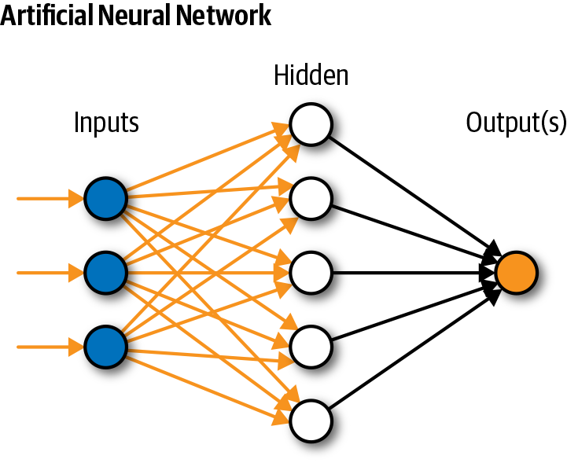

# Neural Network From Scratch
This repository demonstrates a simple neural network coded from scratch in python. Moreover at the end, algorithm is applied over a real world dataset to solve a use case.

Link to dataset used for demonstration: http://archive.ics.uci.edu/ml/datasets/seeds

## Brief Description And Working Of a Neural Network:
Any neural network follows a set of steps, which are:
1. Determining the number of inputs and **initialisation of weights**
2. **Forward Propagation**
    - **Neuron Activation**, which is given by the formula activation = Σ(weight*input)+bias.
    - **Tranfer of Neurons**, passing through an activation function such as sigmoid/relu/tanh.
    - **Forward Propagation**, calculating the output of each neuron
3. **Back Propagation** (weights are trained and error is calculated)
    - **Transfer Derivative**, derivative of activation function.
    - **Error Backpropagation**
        - error = (expectedValue - outputValue) * transferDerivative(outputValue) for neurons in output layer.
        - error = (weight * error) * transferDerivative(outputValue) for neurons in hidden layer. In this case, back propagated error from output layer is accumalted which is used to determine the error.
4. Training the Network, **updating the weights** as we back propagate. Wnew = Wold - η*dL/dt

## Simple Architecture Of a Neural Network

## Code Structure
The code is divided in 4 parts as mentioned above. 

Moreover for solving the usecase, native functions from python are used. For example, instead of using pandas, numpy and scikit, functions such as reading a CSV file, normalising the data and cross validation functions are implemented from scratch as well.

## Results
An accuracy score of **94.2857%** is obtained when number of folds in crossvalidation was set to 6, learning rate as 0.3, number of hidden layers as 5 and 500 epochs for every propagation.

The score array when above parameters are used: **[94.2857, 97.1428, 97.1428, 91.4285, 97.1428, 88.5714]**

## How To Reproduce Above Results?
Clone the repository and run the neural.py file. Note that Python 3 has to installed first. One can install from here, https://www.python.org/downloads/

###### Note that this algorithm is not meant for providing good performance but is an educational one.  

## Future Improvisations
Inclusion of functions such as adding a drop out layer, inclusion of other activation functions, currently sigmoid is being used and better weight initialisation techniques such as Xavier/Gorat and He init, currently a random function is used to initialize weights.
